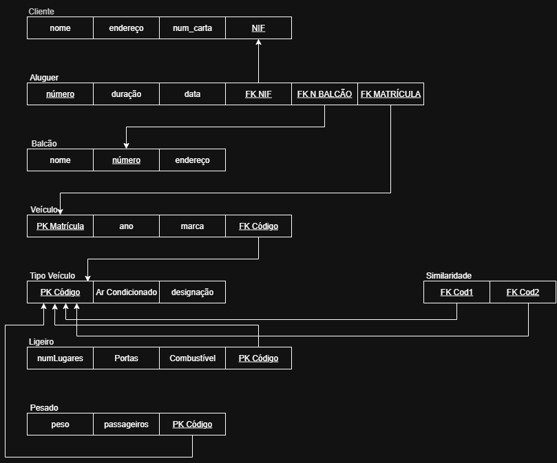
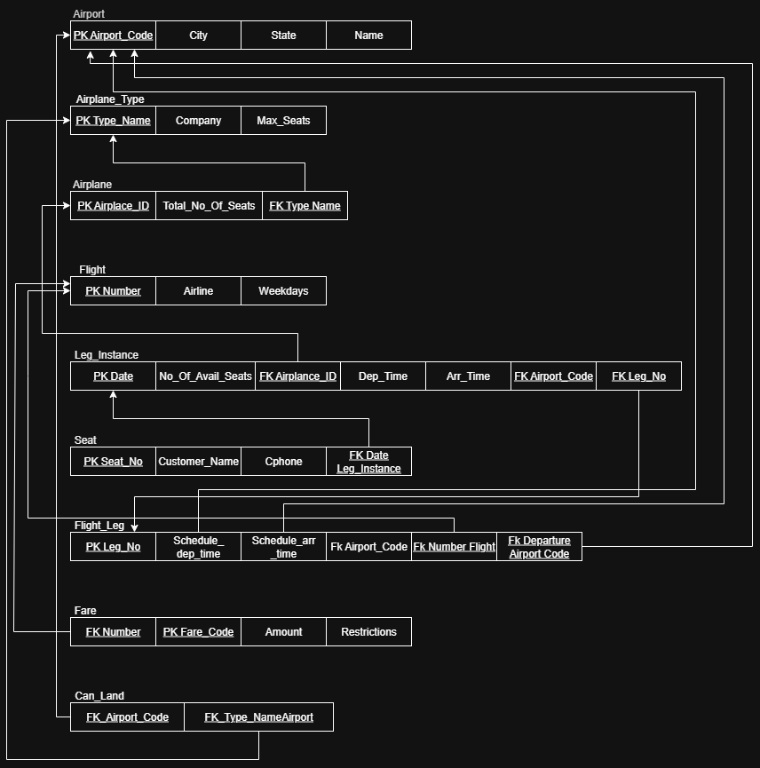
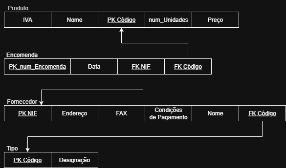
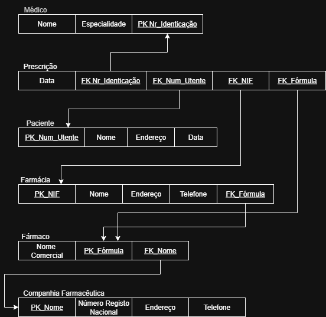
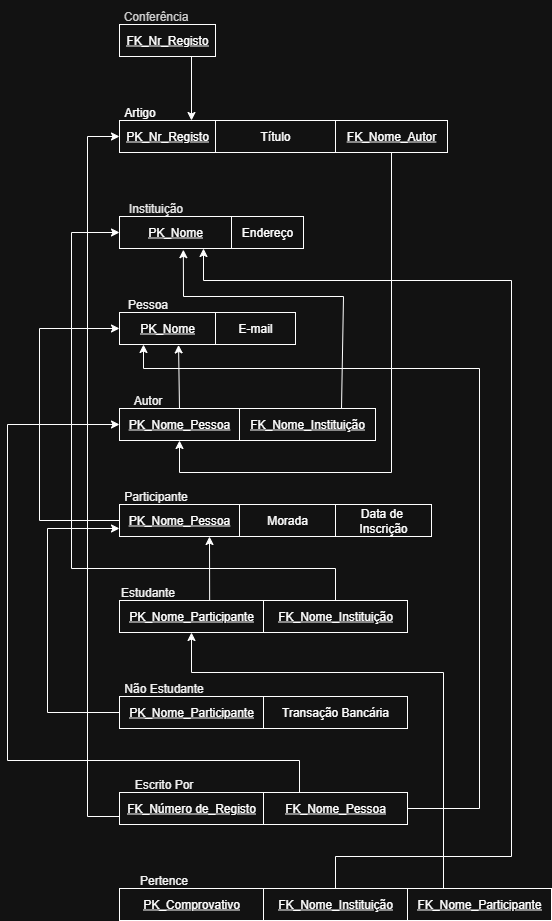
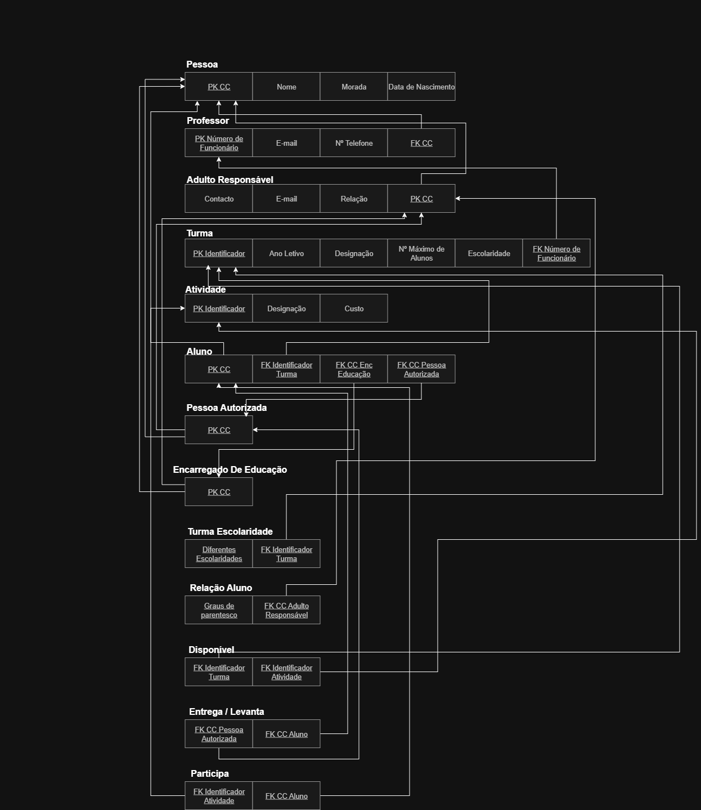

# BD: Guião 3


## ​Problema 3.1
 
### *a)*

```
CLIENTE{
    NIF:Integer
    nome:String
    endereco:String
    num_carta:Integer
}

ALUGUER{
    número:Integer
    duracao:Integer
    data:Integer
}

BALCAO{
    número:Integer
    nome:String
    endereco:String
}

VEICULO{
    marca:String
    matrícula:String
    ano:Integer
}

TIPO_VEICULO{
    designacao:String
    arcondicionado:Boolean
    codigo:Integer
}

LIGEIRO{
    combustivel:String
    portas:Integer
    numlugares:Integer
}

PESADO{
    peso:Integer
    passageiros:Integer
}
```


### *b)* 

```
Cliente: 
Pk - NIF 
Ck(s) - NIF , Num_carta 
Fk(s) - None 

Aluguer: 
Pk - Número 
Ck(s) - Número 
Fk(s) - None 

Balcão: 
Pk - Número 
Ck(s) - Número 
Fk(s) - None 

Veiculo: 
Pk - Matrícula 
Ck(s) - Matrícula 
Fk(s) - None 

Tipo_Veiculo: 
Pk - Código 
Ck(s) - Código 
Fk(s) - None 

Ligeiro: 
Pk - Código 
Ck(s) - Código 
Fk(s) - Código 

Pesado: 
Pk - Código 
Ck(s) - Código 
Fk(s) - Código
```


### *c)* 




## ​Problema 3.2

### *a)*

```
Airport{
    Airport_code:Integer,
    City:String,
    State:String,
    Name:String
};

Airplane_Type{
    Type_name:String,
    Max_seats:Integer,
    Company:String
};

Airplane{
    Airplane_id:Integer,
    Total_no_of_seats:Integer,
    Airplane_Type_name:String
};

Flight{
    Flight_Number:Integer,
    Airline:String,
    Weekdays:String
};

Flight_Leg{
    Flight_Number:Integer,
    Leg_no:Integer,
    Departure_Airport_code:Integer,
    Arrival_Airport_code:Integer,
    Schedule_dep_time:String,
    Schedule_dep_time:String
};

Fare{
    Flight_Number:Integer,
    Code:Integer,
    Restrictions:String,
    Amount:Integer
};

Leg_Instance{
    Airplane_id:Integer,
    No_of_avail_seats:Integer,
    Date:String,
    Leg_no:Integer,
    Dep_time:String,
    Arr_time:String,
    Airport_code:Integer,
};

Seat{
    Airplane_id:Integer,
    Date:String,
    Seat_no:Integer,
    Costumer_Name:String,
    Cphone:Integer
};

Can_Land{
    Airport_code:Integer,
    Airplane_Type_Name:String
};
```


### *b)* 

```
Airport:
Pk - Airport_code
Ck(s) - Airport_code, Name
Fk - None


Airplane_Type:
Pk - Type_name
Ck(s) - Type_name
Fk - None


Airplane:
Pk - Airplane_id
Ck(s) - Airplane_id
Fk - Airplane_Type_name

             
Flight:
Pk - Flight_Number
Ck(s) - Flight_Number
Fk - None

             
Fare:
Pk - Flight_Number, Code
Ck(s) - Flight_Number, Code
Fk - Flight_Number

             
Flight_Leg:
Pk - Departure_Airport_code, Arrival_Airport_code, Flight_Number, Leg_no
Ck(s) - Departure_Airport_code, Arrival_Airport_code, Flight_Number, Leg_no
Fk - Departure_Airport_code, Arrival_Airport_code, Flight_Number

             
Leg_Instance:
Pk - Airplane_id, Date
Ck(s) - Airplane_id, Date
Fk - Airplane_id,Airport_code, Leg_no


Seat:
Pk - Airplane_id, Leg_Instance_Date, Seat_no
Ck(s) - Airplane_id, Leg_Instance_Date,Seat_no
Fk - Airplane_id, Leg_Instance_Date


Can_Land:
Pk -> Airport_code, Airplane_Type_name
Ck(s) -> Airport_code, Airplane_Type_name
Fk -> Airport_code, Airplane_Type_name
```


### *c)* 




## ​Problema 3.3


### *a)* 2.1



### *b)* 2.2



### *c)* 2.3



### *d)* 2.4

